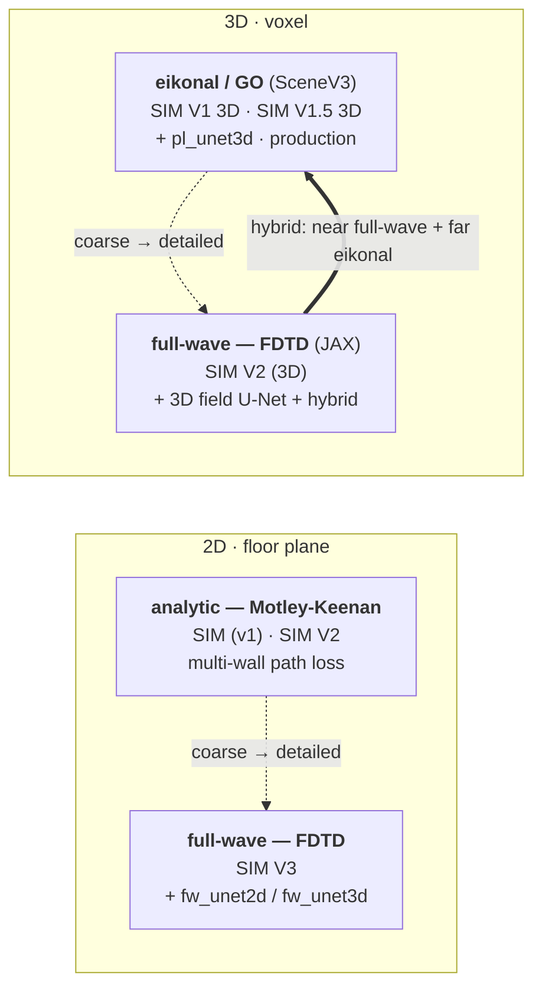

# Physics Engine — layout & navigation

Two RF-propagation stacks, each a sequence of versions. Everything you **run** sits at a
version folder's root; **library code and data** are sorted into role subfolders.

## The engines at a glance

Two axes cut through every folder: **dimension** (2D floor-plane vs 3D voxel) and
**physics** — analytic Motley-Keenan → eikonal/GO → full-wave FDTD (fastest+coarsest to
slowest+exact). Each physics engine also has a fast **U-Net surrogate** trained on it.

| folder | dim | physics | role | status |
|---|---|---|---|---|
| `2D/SIM` | 2D | Motley-Keenan | v1 engine + PL U-Net; also holds `step1_geometry`/`step2_pathloss` | foundational |
| `2D/SIM V2` | 2D | Motley-Keenan | enhanced 7-class MK | selectable solver |
| `2D/_archive/SIM V2.2 (1)` | 2D | — | redundant copy of `SIM V2` | **archived** |
| `2D/SIM V3` | 2D | full-wave FDTD | current 2D full-wave + `fw_unet2d` / `fw_unet3d` | **current 2D** |
| `SIM V1 3D` | 3D | eikonal / GO | SceneV3 + voxelizer + `pl_unet3d` + backend hooks | **current 3D analytic** |
| `SIM V1.5 3D` | 3D | eikonal / GO | thin config / link-budget layer over SceneV3 | wrapper |
| `SIM V2` (3D) | 3D | full-wave FDTD | 3D full-wave (JAX) + 3D field U-Net + hybrid | **current 3D full-wave** |

The *3D* field U-Net (`fw_unet3d`) lives under **`2D/SIM V3`** — it shares SIM V3's full-wave
training stack — and the eikonal far-field it pairs with in the hybrid is the separate
**`SIM V2` (3D)** → **`SIM V1 3D`** engine.

> **Why the version folders aren't physically renamed/regrouped:** the bootstraps and several
> modules locate everything by *folder depth* (`Path(__file__).resolve().parent.parent / "2D" / "SIM"`,
> etc.), and the backend, top-level `SIM`/`SIM3D`/`TESTS3D` symlinks, `.gitignore`, and the Unity
> repo hardcode the current names. Inserting a grouping level or renaming would break all of that
> (and `.resolve()` defeats compat symlinks), so the separation lives in this map instead.

## Version lineage

- **2D (floor-plane):** `2D/SIM` (v1) → `2D/SIM V2` → `2D/SIM V3`  (the redundant `SIM V2.2 (1)` copy is now under `2D/_archive/`)
  - `2D/SIM` (v1) also holds the earliest pipeline stages, folded in:
    `step1_geometry/` (was `2D/STEP_1`, floor-plan raster → model) and
    `step2_pathloss/` (was `2D/STEP_2`, Motley-Keenan heatmap).
- **3D (voxel):** `3D Map Physics/SIM V1 3D` → `.../SIM V1.5 3D` → `.../SIM V2`
- `Cross_Validation/` — predicted-vs-measured RSRP; left as-is.

## Folder convention (every version folder)

| Location | Holds |
|---|---|
| **(root)** | the bootstrap shim + README (and, for `SIM V1 3D`, the backend-invoked `voxelize.py`/`export_web3.py`, the depth-coupled libs `modes_3d`/`cache_index`/`voxelize_city`, and the canonical scene data, which are wired to that exact path) |
| **`run/`** | the entry-point scripts you invoke (`run_*`, `phase_*`, `export_*`, `fetch_*`, `fw_solver/infer/export`, dataset generators). Each carries a 2-line `sys.path` shim so it still finds its bootstrap/siblings from one level down. |
| **`physics/`** | EM cores, engines, FDTD/full-wave, near/far-field, hybrid, extractors |
| **`surrogate/`** | U-Net / JAX models, training, featurization (the "unet-specific" code) |
| **`helpers/`** | bands, antenna patterns, georef, catalogs, perf, config, contracts (getters/config) |
| **`assets/`** | `.npy/.npz/.pt/.json/.png` data (scene inputs, weights, outputs) |
| **`docs/`**, **`notebooks/`** | `.md/.pdf` reference · `.ipynb` |

## Role map (bucketed library modules)

| Folder | `physics/` | `surrogate/` | `helpers/` |
|---|---|---|---|
| `2D/SIM` | engine_v2, engine_v2_torch, physics_v2 | — | — |
| `2D/SIM V2.2 (1)` | engine_v2, engine_v2_torch, physics_v2 | — | — |
| `2D/SIM V3` | fullwave2d, nearfield, plane_extract, hybrid_field, hybrid_city, fw_field3d, fw_field3d_floor | fw_unet2d, fw_unet3d | bands_v3, antenna_patterns, city_georef, fw_bs_catalog, perf_v3 |
| `SIM V1 3D` | engine_3d, physics_3d | dataset_3d, models_3d, plane_surrogate_3d | contracts |
| `SIM V1.5 3D` | engine, pathloss_models | — | link_budget, pathloss_config |
| `SIM V2` (3D) | fullwave3d, fw_fdtd_jax, far_field_3d, nearfield_3d, hybrid_field_3d, solid_extract, fw_field3d, fw_field3d_floor | unet3d_jax, unet3d_train_jax | bands_v1_for_3D, antenna_patterns_3D, cad_materials, city_georef, indoor_georef, fw_bs_catalog, perf_v2_3d |

`2D/SIM V2` has no engine of its own (it reuses v1's) — only `assets/notebooks/docs`.

## How imports survive the layout

Each folder's bootstrap (`_bootstrap.py` / `bootstrap.py`) adds its own role subfolders — and
those of every engine it reuses — to `sys.path` via an `_add_tree()` helper. So the bare-name
imports the engine uses everywhere (`import fullwave2d`, `import bands_v3`, `import physics_3d`)
still resolve after the modules were bucketed one level deeper.

**Compat symlinks** (e.g. `SIM/physics_v2.py → physics/physics_v2.py`, `2D/STEP_1 → SIM/step1_geometry`,
and the six `SIM V1 3D` lib symlinks) are the shims for code / JSON / notebooks that reference a
file by *filesystem path* rather than by import. **They are load-bearing — do not delete them.**

## Deliberately kept flat (at a folder root)

Some files are **not** bucketed, on purpose:

- **Backend-invoked:** `SIM V1 3D/voxelize.py` and `export_web3.py` — `Backend/server/pipeline.py`
  runs them by absolute path.
- **Root-coupled 3D libs:** `SIM V1 3D/modes_3d.py`, `cache_index.py`, `voxelize_city.py` — they
  compute multi-level parent paths and/or hash sibling files by path; moving them would break
  scene/cache/registration loading.
- **The canonical 3D scene** (`SIM V1 3D/material_grid.npy`, `inside_mask.npy`, `manifest_3d.json`,
  `valid_tx_mask.npy`, `registration_3d.json`) stays at the folder root, which the bootstraps,
  `tests3d/`, cross-validation, and the backend all treat as `SCENE_DIR`.
